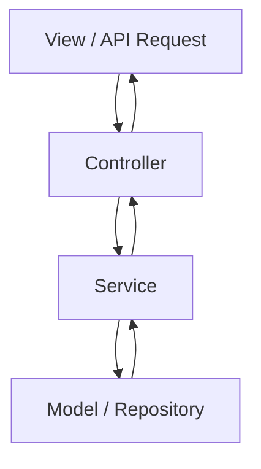

# 🚀 دليل المعمارية النظيفة

هذا المستند هو المرجع الرسمي للنمط المعماري المتبع في المشروع. الهدف هو الحفاظ على كود نظيف، منظم، وقابل للصيانة على المدى الطويل.

## 1. المبادئ الأساسية

نحن نتبع نسخة مبسطة وعملية من **Clean Architecture**، مع التركيز على فصل الاهتمامات (Separation of Concerns).

### 1.1. تدفق البيانات (The Flow)

يجب أن يتبع تدفق البيانات في أي طلب (Request) هذا المسار بشكل صارم:



- **Controller:** يستقبل الطلب، يتحقق من المدخلات الأساسية، ويستدعي الـ Service المناسب. **ممنوع** وضع أي Business Logic هنا.
- **Service:** يحتوي على كل الـ Business Logic. ينسق بين الـ Models، يستدعي Services أخرى، ويجهز البيانات.
- **Model:** يمثل طبقة الوصول للبيانات (Database). **ممنوع** وضع أي Business Logic معقد هنا (باستثناء Scopes البسيطة).

### 1.2. القاعدة الذهبية

> **لا Business Logic في Views أو Controllers، فقط في Services.**

أي كود يقوم بـ:
- حسابات معقدة
- تنسيق بيانات
- اتخاذ قرارات بناءً على شروط متعددة
- استدعاء Models متعددة

**يجب** أن يكون داخل Service.

## 2. هياكل البيانات (Data Structures)

### 2.1. DTOs (Data Transfer Objects)

**جميع** البيانات التي يتم إرسالها من Controller إلى View، أو إرجاعها من API Endpoint، **يجب** أن تكون على شكل DTO.

- **لماذا؟** لضمان وجود مصدر موحد للحقيقة (Single Source of Truth) وشكل بيانات متسق عبر جميع المنصات.
- **أين؟** يتم إنشاء DTOs داخل `app/Domain/{Module}/DTOs`.
- **كيف؟** يتم استخدام `spatie/laravel-data` لإنشاء DTOs.

**مثال:** `CatalogItemCardDTO` هو الشكل الموحد لعرض أي منتج في أي مكان.

### 2.2. Models (Eloquent)

- **ممنوع** تمرير Eloquent Models مباشرة إلى Views أو API Responses.
- **لماذا؟** لأن الـ Models قد تحتوي على بيانات حساسة، ولأن شكلها قد يتغير، مما يكسر الـ Views.

## 3. حقن التبعيات (Dependency Injection)

**دائماً** استخدم Constructor Injection لحقن الـ Services أو الـ Classes الأخرى. **ممنوع** استخدام `app()` helper.

**✅ صحيح:**
```php
class MyController extends Controller
{
    public function __construct(private MyService $myService) {}

    public function index()
    {
        $data = $this->myService->getData();
        // ...
    }
}
```

**❌ خاطئ:**
```php
class MyController extends Controller
{
    public function index()
    {
        $myService = app(MyService::class);
        $data = $myService->getData();
        // ...
    }
}
```

## 4. أمثلة عملية

### 4.1. عرض قائمة منتجات

1. **Controller:** يستقبل الطلب، يستدعي `CatalogItemApiService::getCatalogItems()`.
2. **Service:** يقوم بالـ Query، يطبق الفلاتر، ويستخدم `CatalogItemCardDTOBuilder` لتحويل كل Model إلى DTO.
3. **Controller:** يمرر `Collection<CatalogItemCardDTO>` إلى الـ View.
4. **View:** يقوم بعمل `foreach` على الـ DTOs ويعرض الحقول مباشرة (مثل `$card->name`, `$card->price`).

### 4.2. إضافة منتج للمفضلة

1. **Controller:** يستقبل الطلب، يستدعي `FavoriteService::add()`.
2. **Service:** يقوم بالتحقق من الشروط، يحفظ في الـ Database، ويطلق `ProductFavoritedEvent`.
3. **Listener:** يستمع للـ Event ويقوم بأي عمليات إضافية (مثل إرسال إشعار).
